# WanderLust

**Deployed Site**: [WanderLust](https://wanderlust-3xf6.onrender.com)

## Overview  
**WanderLust** is a responsive web application designed to help users explore, list, and manage rental properties. It allows users to create accounts, add property listings, and search or filter available options easily. Built with technologies like **Node.js**, **Express.js**, **MongoDB**, **Bootstrap**, **HTML**, **CSS**, and **JavaScript**, WanderLust provides a smooth and user-friendly experience.

## Features  
- **User Registration & Authentication**: Secure session-based authentication for users to register, log in, and manage their rental listings.  
- **Room Listings**: Create and display detailed rental listings with information such as price, location, description, and amenities.  
- **MVC Architecture**: Follows the Model-View-Controller (MVC) pattern for efficient and scalable code organization.  
- **MongoDB Integration**: Stores user accounts, property listings, and related data with reliability and scalability.  
- **Responsive Design**: Utilizes Bootstrap for a mobile-first, responsive user interface.  
- **Form Validation**: Implements both client-side and server-side validation for enhanced data integrity and user experience.  
- **Search and Filter**: Enables users to search and filter listings by price range, location, and amenities.  
- **Admin Dashboard**: Allows admin users to approve or reject submitted listings for quality control.  
- **Real-Time Data Updates**: Ensures that changes to listings and user data are reflected immediately for an interactive experience.  

## Technologies Used  
**Frontend**:  
- HTML: Structuring web pages  
- CSS: Styling the user interface  
- JavaScript: Enhancing interactivity  
- Bootstrap: Ensures responsive, mobile-first design  

**Backend**:  
- Node.js: Runtime environment for backend server development  
- Express.js: Framework for routing and server-side logic  

**Database**:  
- MongoDB: NoSQL database for storing user and listing data  

**Authentication**:  
- Implements session-based authentication using Passport.js for secure user login and data access.

**Architecture**:  
- Model-View-Controller (MVC) pattern for code organization  

## Usage  

### Features for Users  
- **Manage Listings**:  
  - View, add, edit, and delete rental listings.  
  - Listings include detailed information such as price, location, description, and amenities.  
  - Dynamically renders listings based on data stored in MongoDB.  

- **Search & Filter**:  
  - Filter listings based on price range, location, and amenities.  
  - Helps users quickly find rooms that meet their specific needs.  

- **Reviews**:  
  - Users can leave reviews and ratings for listed properties.  
  - Reviews are displayed on property pages, helping others make informed decisions.

### Features for Admins  
- **Admin Dashboard**:  
  - Manage all users, including the ability to delete accounts.  
  - Edit or delete property listings as needed.  
  - Remove reviews to maintain platform standards.  

### Data Persistence  
- **MongoDB Integration**:  
  - Ensures data persistence across sessions.  
  - Stores user-generated content and interactions reliably.  

## Screenshots  

1. **Login Page**  

   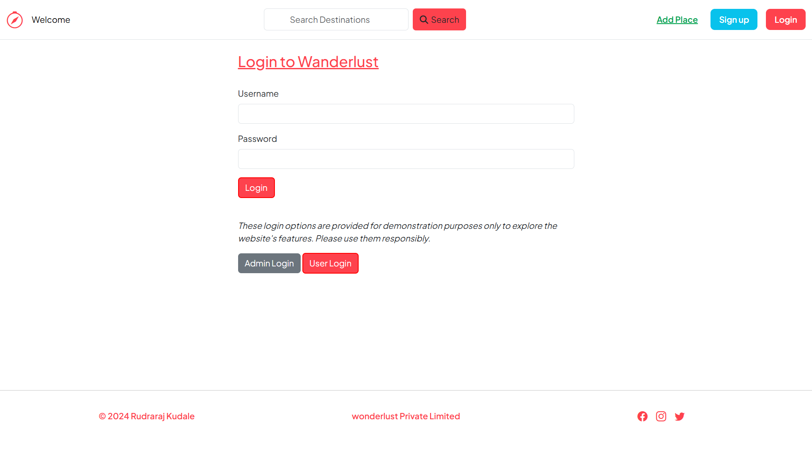 

2. **SignUp Page** 

   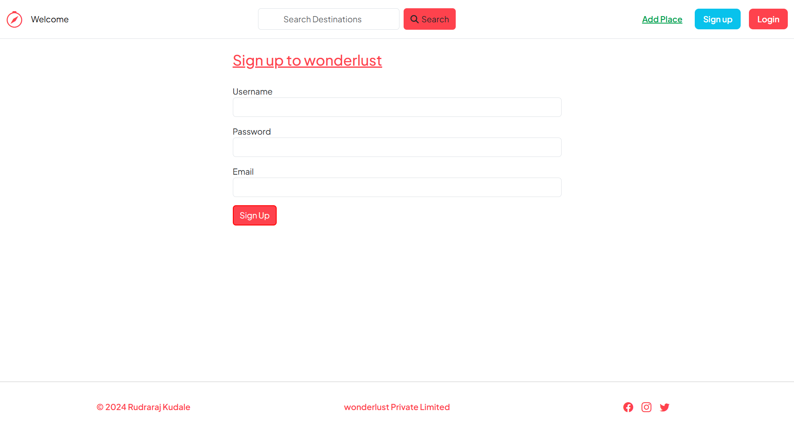 
 

3. **Index Page**  

   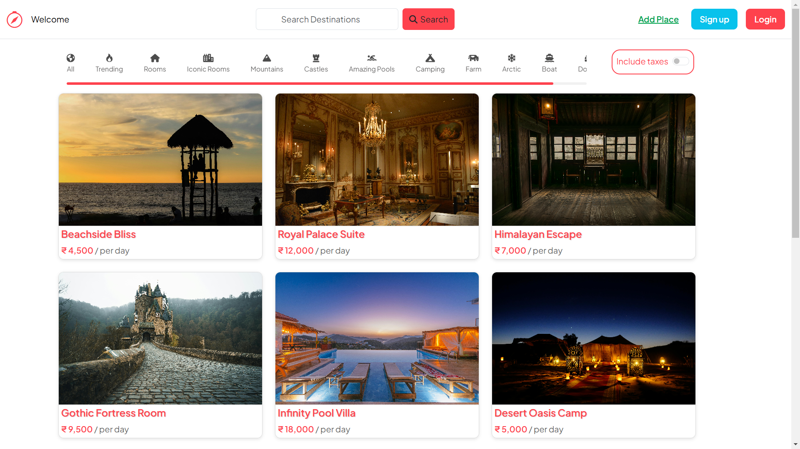 

4. **Index Page with GST**  

   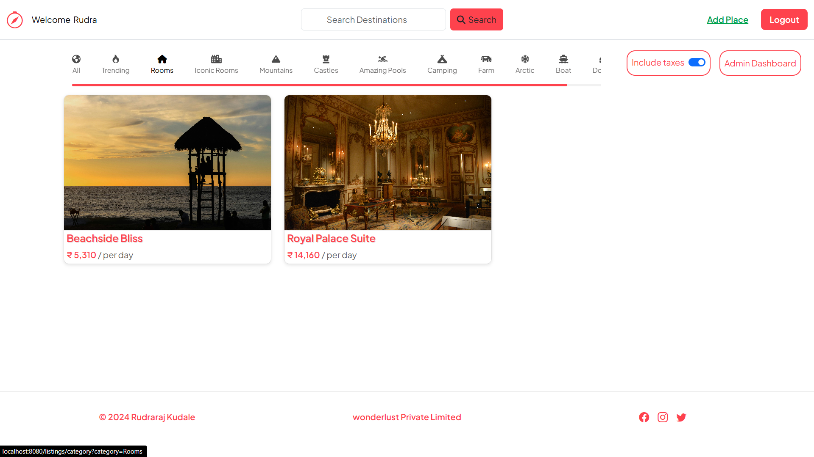 

5. **Add Place Page**  

   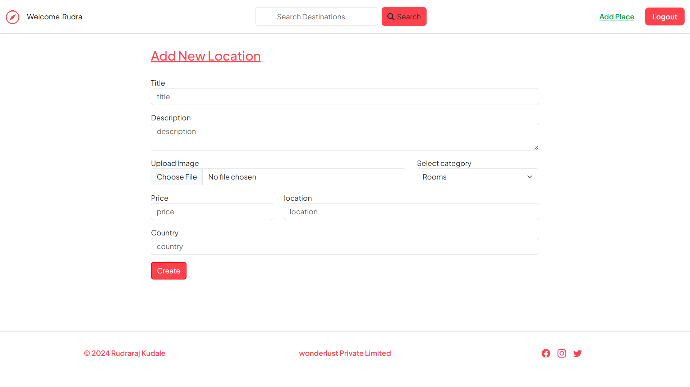 
 

6. **Show Place Page** 

   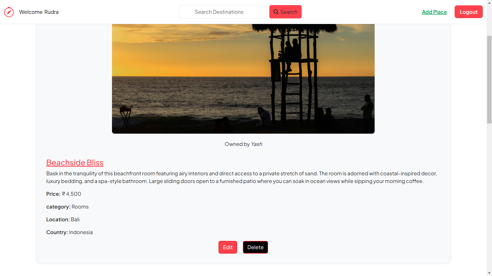 

7. **Edit Place Page**  

   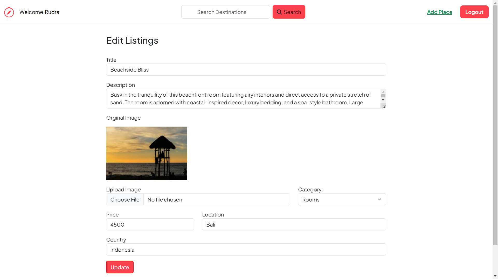 

8. **Add review**  

   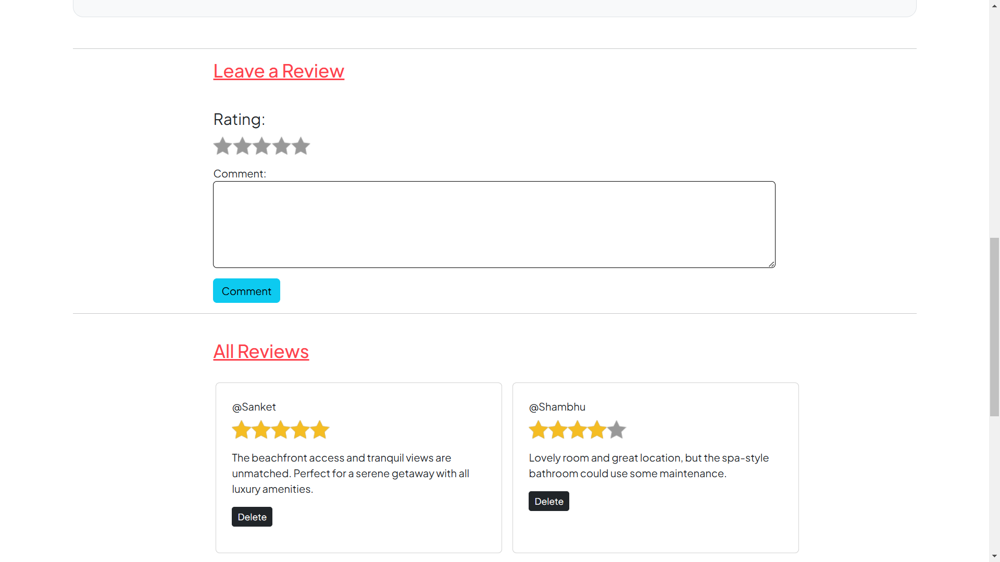 
 

9. **Check Location of place** 

   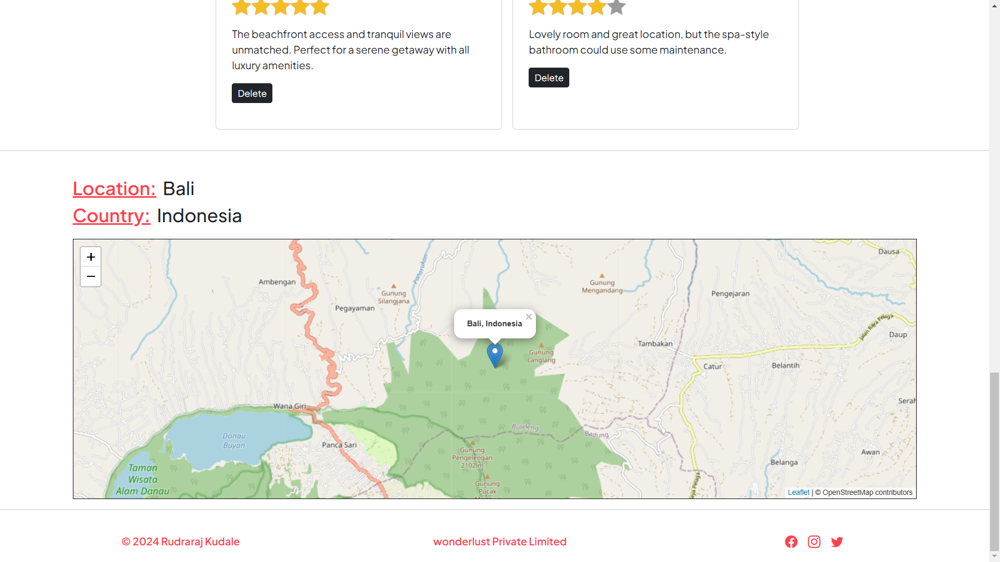 

10. **Admin Page**  

   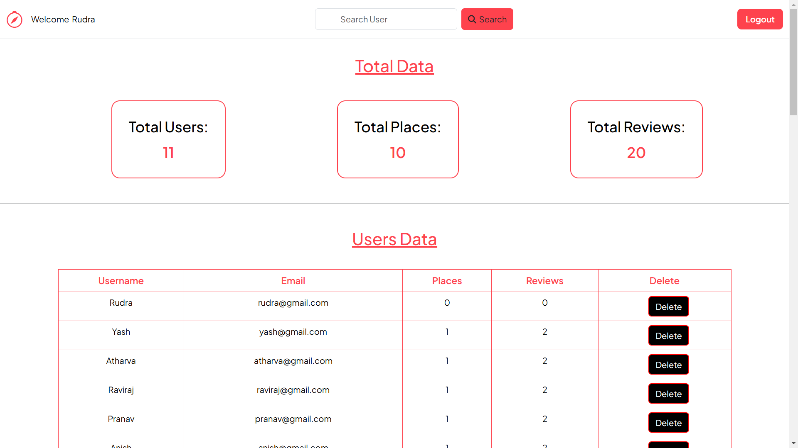 

11. **Manage Users**  

   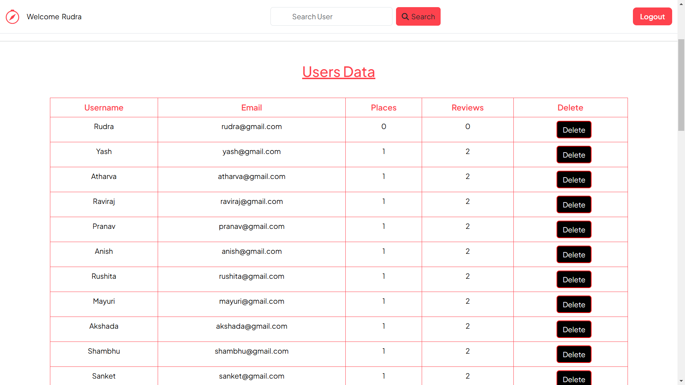 
 

12. **Manage Places**  

   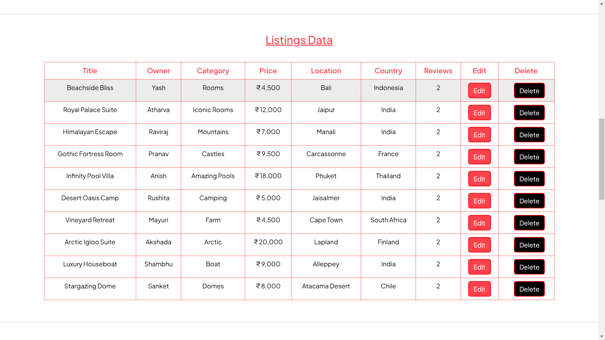 
  

13. **Manage reviews**  

   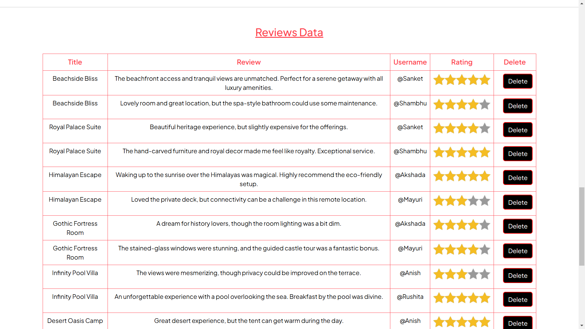 